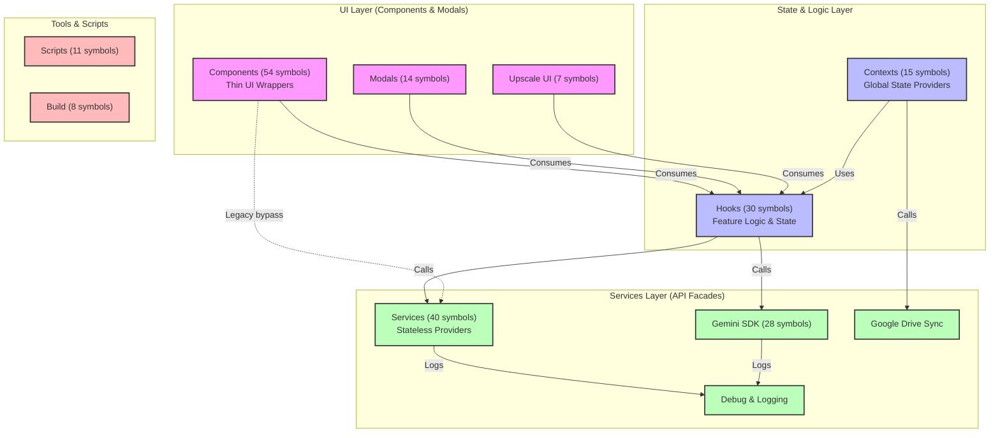

# Chang-Store Architecture

This document provides a high-level overview of the Chang-Store architecture based on the automated code knowledge graph analysis. 

## Overview
The architecture is a modern React application consisting of roughly 150 files and over 1,100 symbols. It follows a strict separation of concerns utilizing a "Thin Component -> Stateful Hook -> Stateless Service" flow. 

## Architecture Diagram

## Functional Areas (Clusters)
The codebase organically groups into the following highly-cohesive functional areas (modules):

1. **Components (54 symbols)**: The UI presentation layer composed of thin React components.
2. **Services (40 symbols)**: Stateless API facades and integration code (e.g., `imageEditingService.ts`, `upscaleAnalysisService.ts`).
3. **Hooks (30 symbols)**: Core business and feature logic isolated behind React hooks. Controls state.
4. **Gemini (28 symbols)**: Specialized service integration for Google's Gemini generative AI.
5. **Contexts (15 symbols)**: Global state providers like `ImageGalleryProvider`.
6. **Modals (14 symbols)**: Reusable modal interfaces.
7. **Scripts (11 symbols)**: Automation and tooling.
8. **Build (8 symbols)**: Configuration and bundler setups.
9. **Upscale (7 symbols)**: Specialized feature domain for image upscaling.

## Key Execution Flows

The top execution flows across the system highlight how the application connects the UI to standard platform services and integrations:

1. **Feature to Debug Verification (`PoseChanger` / `BackgroundReplacer` → `IsDebugEnabled`)**
   - Components like `PoseChanger` or `BackgroundReplacer` directly or indirectly trigger an image editing hook.
   - The hook invokes `upscaleImage` via the `imageEditingService`.
   - The service resolves the request through `logApiCall` up to `isDebugEnabled` in `debugService`.

2. **Feature to External API (`Upscale` → `GetActiveApiKey`)**
   - The `Upscale` component delegates to `useUpscale`.
   - The hook defers analysis to `analyzeImage` in the `upscaleAnalysisService`.
   - The service instantiates the AI client through `getGeminiClient`.
   - The client verifies standard authentication resolving to `getActiveApiKey` in `apiClient.ts`.

3. **Context Sync (`ImageGalleryProvider` → `GenerateContentHash`)**
   - The global `ImageGalleryProvider` manages active session images.
   - It utilizes `useGoogleDriveSync` to persist user data to the cloud.
   - This invokes `uploadImage` via the `googleDriveService`.
   - The service validates integrity using `generateContentHash`.

These flows prove out the architectural pattern of Thin Component delegating to a Stateful Hook, which invokes Stateless Infrastructure Service facades.
