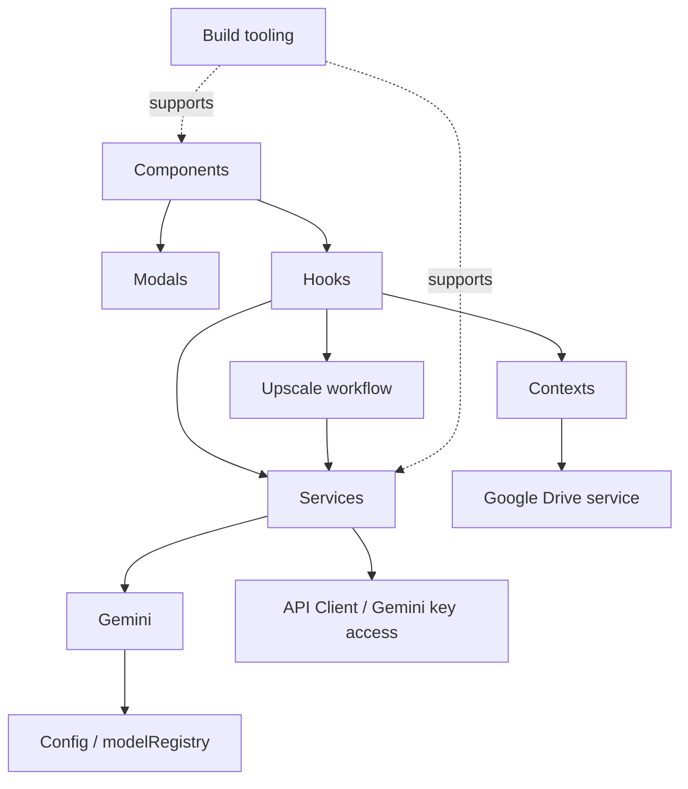

# ARCHITECTURE

> Generated from the GitNexus knowledge graph for `Chang-Store`.
> GitNexus local snapshot at generation time: 155 files, 1209 symbols, 88 execution flows.
> Indexed commit: `22a00e6` (up to date with the local repository when this document was refreshed).

## Overview

Chang-Store is an AI-powered virtual fashion studio built as a React 19 + TypeScript + Vite SPA. The architecture centers on a layered flow from presentation components into hooks, service facades, provider-specific integrations, and global state contexts.

The knowledge graph shows a codebase organized around a few strongly cohesive areas:

- `Components` — presentation layer and feature entry points
- `Hooks` — feature logic and orchestration
- `Services` — stateless service facade layer
- `Gemini` — provider-specific AI image and text operations
- `Config` — model registry and capability selection
- `Contexts` — global app state and cross-feature persistence
- `Modals` — UI overlays and settings surfaces
- `Upscale` — specialized upscale workflow
- `Build` — tooling and runtime setup

At a high level, the application behaves like this:

`Component → Hook → Service/Provider call → Config lookup / API client → Context side effects`

## Functional Areas

### 1. Components

The `Components` cluster is the primary UI surface and contains feature entry points such as `Upscale`, `PoseChanger`, and other task-specific screens. These components either act as thin wrappers over hooks or, in some older flows, still hold orchestration logic directly.

- Cluster size: 69 symbols
- Cohesion: 92%

### 2. Hooks

The `Hooks` cluster contains feature logic, request orchestration, validation, and state coordination. It is the bridge between UI intent and lower-level services.

- Cluster size: 22 symbols
- Cohesion: 81%

Representative role in graph:
- `useUpscale` sits between `Upscale` and service/API access.
- `useGoogleDriveSync` mediates gallery actions into Drive requests.

### 3. Services

The `Services` cluster is a highly cohesive facade layer that routes feature actions into provider-specific implementations and shared infrastructure.

- Cluster size: 41 symbols
- Cohesion: 96%

Representative responsibilities:
- image editing/generation orchestration
- Drive access
- API client creation
- upscale analysis

### 4. Gemini

The `Gemini` cluster contains provider-specific AI generation and transformation logic. GitNexus shows multiple important flows terminating in Gemini image operations before delegating into model capability selection.

- Cluster size: 23 symbols
- Cohesion: 92%

Representative functions seen in the graph:
- `editImage`
- `generateSingleImage`
- `critiqueAndRedesignOutfit`
- `generateSingleRedesign`

### 5. Config

The `Config` cluster is a key decision-making layer for model selection and capability routing. The knowledge graph highlights `src/config/modelRegistry.ts` as part of important generation flows.

- Cluster size: 18 symbols
- Cohesion: 85%

Representative functions seen in graph traces:
- `getModelCapabilities`
- `getRegisteredModel`
- `buildModelCandidates`

### 6. Contexts

The `Contexts` cluster manages shared application state and persistence-backed workflows. It appears in key execution flows around image gallery state and Google Drive synchronization.

- Cluster size: 13 symbols
- Cohesion: 90%

Representative role in graph:
- `ImageGalleryProvider` triggers sync work through `useGoogleDriveSync`, which then delegates to Drive service calls.

### 7. Modals

The `Modals` cluster represents highly cohesive UI overlays such as settings and dialogs.

- Cluster size: 13 symbols
- Cohesion: 100%

### 8. Upscale

The `Upscale` cluster represents a specialized workflow with its own analysis and API access path.

- Cluster size: 7 symbols
- Cohesion: 100%

### 9. Build

The `Build` cluster covers bundling and tooling infrastructure.

- Cluster size: 8 symbols
- Cohesion: 100%

## Mermaid Diagram

## Key Execution Flows

### 1. Edit image → model candidate selection

GitNexus process: `EditImage → BuildModelCandidates` (`intra_community`)

Trace:
1. `editImage` — `src/services/gemini/image.ts`
2. `generateSingleImage` — `src/services/gemini/image.ts`
3. `getModelCapabilities` — `src/config/modelRegistry.ts`
4. `getRegisteredModel` — `src/config/modelRegistry.ts`
5. `buildModelCandidates` — `src/config/modelRegistry.ts`

Why it matters:
- This flow shows that image generation/editing is not just a direct Gemini call.
- The provider layer delegates into a model capability registry before final model candidate construction.
- `src/config/modelRegistry.ts` is a central architecture node for AI routing decisions.

### 2. Outfit critique/redesign → model candidate selection

GitNexus process: `CritiqueAndRedesignOutfit → BuildModelCandidates` (`intra_community`)

Trace:
1. `critiqueAndRedesignOutfit` — `src/services/gemini/image.ts`
2. `generateSingleRedesign` — `src/services/gemini/image.ts`
3. `getModelCapabilities` — `src/config/modelRegistry.ts`
4. `getRegisteredModel` — `src/config/modelRegistry.ts`
5. `buildModelCandidates` — `src/config/modelRegistry.ts`

Why it matters:
- This confirms the model registry is shared across multiple AI generation paths, not only one feature.
- The `Config` cluster is an architectural dependency of higher-level fashion critique flows.

### 3. Upscale → API key resolution

GitNexus process: `Upscale → GetActiveApiKey`

Trace:
1. `Upscale` — `src/components/Upscale.tsx`
2. `useUpscale` — `src/hooks/useUpscale.ts`
3. `analyzeImage` — `src/services/upscaleAnalysisService.ts`
4. `getGeminiClient` — `src/services/apiClient.ts`
5. `getActiveApiKey` — `src/services/apiClient.ts`

Why it matters:
- This is a clean example of the intended layered flow: component → hook → service → API client.
- It shows that upscale processing depends on both image analysis logic and centralized API client/key management.

### 4. Gallery persistence → Google Drive

GitNexus process: `ImageGalleryProvider → DriveRequest`

Trace:
1. `ImageGalleryProvider` — `src/contexts/ImageGalleryContext.tsx`
2. `useGoogleDriveSync` — `src/hooks/useGoogleDriveSync.ts`
3. `getOrCreateAppFolder` — `src/services/googleDriveService.ts`
4. `driveRequest` — `src/services/googleDriveService.ts`

Why it matters:
- This flow captures the persistence side of the app, not just AI generation.
- Context-driven gallery state can trigger sync behavior that ultimately becomes Google Drive API traffic.
- It also shows the app’s cross-cutting architecture: context state + hook orchestration + service execution.

### 5. Pose change → service config construction

GitNexus process: `PoseChanger → BuildImageServiceConfig`

Trace:
1. `PoseChanger` — `src/components/PoseChanger.tsx`
2. `handleRegenerateSingle` — `src/components/PoseChanger.tsx`
3. `handleGenerate` — `src/components/PoseChanger.tsx`
4. `generateImageForPrompt` — `src/components/PoseChanger.tsx`
5. `buildImageServiceConfig` — `src/components/PoseChanger.tsx`

Why it matters:
- This is an important exception to the preferred architectural pattern.
- GitNexus shows orchestration staying inside the component instead of cleanly passing through a dedicated hook.
- It identifies `PoseChanger` as a good candidate for future refactoring toward the standard component → hook pattern.

## Known Architectural Exceptions

These items currently deviate from the preferred `Component → Hook → Service` architecture and are ordered below by refactor priority.

1. `PoseChanger` (`src/components/PoseChanger.tsx`) — highest priority because GitNexus already shows end-to-end generation orchestration and `buildImageServiceConfig` living inside the component.
2. `SettingsModal` — high priority because it touches shared provider and model configuration, so layering mistakes here can leak across multiple features.
3. `AIEditor`, `ImageEditor` — high-to-medium priority because these editor/orchestrator surfaces tend to accumulate broad service coupling and are good candidates for hook-first decomposition.
4. `OutfitAnalysis`, `PhotoAlbumCreator`, `Relight` — medium priority because they are feature-specific generation flows with meaningful orchestration, but a narrower blast radius than the editor and configuration surfaces.
5. `LookbookOutput`, `shared/RefinementInput` — lower priority because they are downstream output/refinement surfaces and can follow after the higher-leverage orchestration refactors above.

## Refactor Roadmap

This roadmap turns the exception list above into an execution sequence for moving the remaining component-heavy flows toward the target `Component → Hook → Service` architecture.

### RALPLAN-DR Summary

Principles:
- Components remain thin UI wrappers.
- Hooks own orchestration, state coordination, validation, loading, error, and side-effect flow.
- Service facades remain the only runtime API/provider entry points.
- Each phase must have measurable gates and a rollback path.

Decision drivers:
1. Blast radius of each surface.
2. Current service/config coupling inside components.
3. Ability to preserve behavior parity through incremental rewiring.

Chosen option: refactor by risk and dependency boundary rather than by isolated component order. This keeps cross-cutting configuration work ahead of the editor and generation flows that depend on it.

Dependency chain:

`P0 → P1 → P2 → P3A → P3B → P4 → P5`

`P3B` and `P4` only open after `P2` passes, because editor and generation flows depend on stable provider/model settings behavior.

### Verification & Rollback Contract

For every phase, record before/after runtime service import counts for the scoped components using the same P0 inventory method. Type-only imports are tracked separately; P5 may temporarily use `import type` or move shared types such as `RefinementHistoryItem` into `src/types.ts` or a hook-owned type contract.

Required gates:
1. `npx tsc --noEmit` passes.
2. `npm run lint` passes.
3. `npm run test` passes for the targeted smoke/regression scope.
4. `npm run build` passes at the major gates: P2, P3B, and P5.
5. Runtime service imports in scoped components do not increase; phase targets require runtime service imports to reach zero where specified.

Rollback triggers:
- build or test gates fail twice in a row,
- a parity flow breaks,
- provider/model settings behavior regresses,
- or a phase introduces a new architectural exception.

Rollback action: revert the current phase rewiring, restore the previous boundary temporarily, record the blocker and root cause, then reopen the phase with a smaller scope.

| Phase | Required smoke/regression evidence | Rollback |
|---|---|---|
| P0 | Baseline table covering runtime service/config imports, handler map, frozen hook contract, and smoke matrix owner | Docs-only revert |
| P1 | Pose text/reference generate + single regenerate; runtime service/config imports in `PoseChanger` = 0 | Revert P1 commit; component path restored |
| P2 | Provider/model selection persistence, storage backup/restore/clear, debug toggle behavior; provider order snapshot unchanged | Revert P2 commit; restore exported storage backup; reset debug flag |
| P3A | `ImageEditor` edit pipeline + AI generate pipeline; runtime service imports = 0 | Revert P3A commit |
| P3B | `AIEditor` refine/edit smoke using the P3A hook contract; runtime service imports = 0 | Revert P3B commit |
| P4 | `OutfitAnalysis`, `PhotoAlbumCreator`, and `Relight` each pass generate/regenerate smoke; 3/3 route through hooks | Revert P4 commit |
| P5 | `RefinementHistoryItem` moves out of the service boundary or is consumed through a hook/type contract; lookbook/refinement compatibility smoke passes | Revert P5 commit |

### Phase Plan

#### P0 — Baseline & Contract Freeze

Scope: all current architectural exceptions and their existing hooks.

Deliverables:
- inventory runtime service/config imports in scoped components,
- map component-owned orchestration handlers,
- freeze component ↔ hook ↔ service input/output contracts,
- define the smoke matrix and owner for each phase.

Exit criteria: the baseline covers every exception target and has an accepted contract plus smoke matrix.

##### P0 Baseline Inventory — 2026-04-26

This baseline freezes the current exception surface before any roadmap rewiring. Runtime service/config imports count imports that execute at runtime from `src/services/**` or `src/config/**`; type-only imports are tracked separately because they describe contract coupling without adding runtime calls.

| Target | Existing hook/contract owner | Runtime service/config imports | Type-only service/config imports | Component-owned orchestration handlers | Frozen contract | Smoke owner |
|---|---|---:|---:|---|---|---|
| `PoseChanger` (`src/components/PoseChanger.tsx`) | `usePoseChanger` exists but is incomplete before P1 | 2 (`imageEditingService`, `textService`) | 0 | `buildImageServiceConfig`, `handleGeneratePoseDescription`, `generateImageForPrompt`, `handleGenerate`, `handleRegenerateSingle`, `handleUpscale`, pose-reference/library selection handlers | `PoseChanger` supplies UI bindings; `usePoseChanger` owns state, prompt construction, validation, service calls, loading/error, generate/regenerate/upscale side effects; services remain behind `imageEditingService.ts` and `textService.ts` | P1: Pose reference generate, text/library generate, single regenerate, upscale smoke |
| `SettingsModal` (`src/components/modals/SettingsModal.tsx`) | `ApiProviderContext`, `ImageGalleryContext`, storage/debug adapters | 2 (`modelRegistry`, `debugService`) | 1 (`RegisteredModel` from `modelRegistry`) | `handleDebugToggle`, `handleSave`, `handleRestore`, `handleClear`, provider/model option filtering | Settings UI binds provider/storage/debug actions; focused hook/adapter boundary must own model filtering, persistence, backup/restore/clear, and debug toggles | P2: provider/model persistence, storage backup/restore/clear, debug toggle, provider order snapshot |
| `ImageEditor` (`src/components/ImageEditor.tsx`) | `useImageEditor` exists but component still owns canvas/API orchestration | 1 (`imageEditingService`) | 0 | `buildImageServiceConfig`, `handleApply*`, `handleGenerateAIEdit`, `handleApplyAccessory`, canvas/history handlers | `ImageEditor` keeps canvas/UI interaction; `useImageEditor` owns API orchestration, history side effects, loading/error, and editor action contracts | P3A: edit pipeline, AI generate pipeline, runtime service imports = 0 |
| `AIEditor` (`src/components/AIEditor.tsx`) | No dedicated hook yet; intended to reuse editor boundary after P3A | 1 (`imageEditingService`) | 0 | `handleGenerate`, prompt mention extraction, API prompt construction | Component remains a multi-image/prompt UI; future hook owns prompt validation, mention resolution, API call, loading/error, and result state | P3B: refine/edit smoke through P3A boundary, runtime service imports = 0 |
| `OutfitAnalysis` (`src/components/OutfitAnalysis.tsx`) | `useOutfitAnalysis` exists but is incomplete before P4 | 2 (`imageEditingService`, `textService`) | 1 (`RedesignPreset` from `gemini/image`) | `buildImageServiceConfig`, `handleUpload`, `handleGenerateRedesigns`, `handleExtractItem`, preset selection | Component binds analysis/redesign UI; hook owns upload analysis, redesign generation, extraction, loading/error, and gallery side effects | P4: outfit analysis generate/regenerate/extract smoke |
| `PhotoAlbumCreator` (`src/components/PhotoAlbumCreator.tsx`) | `usePhotoAlbum` exists but is incomplete before P4 | 1 (`imageEditingService`) | 0 | `buildImageServiceConfig`, `generateImageForPose`, `handleGenerate`, `handleRegenerateSingle`, mode/start-over handlers | Component binds album controls; `usePhotoAlbum` owns pose prompt generation, batch progress, regenerate, loading/error, and gallery side effects | P4: photo album generate/regenerate smoke |
| `Relight` (`src/components/Relight.tsx`) | `useRelight` exists but is incomplete before P4 | 1 (`imageEditingService`) | 0 | `generateRelightPrompt`, `buildImageServiceConfig`, `handleRelight` | Component binds lighting controls; `useRelight` owns prompt construction, service call, loading/error, and result state | P4: relight generate/regenerate smoke |
| `LookbookOutput` (`src/components/LookbookOutput.tsx`) | `useLookbookGenerator` owns generation; output component owns downstream UI | 0 | 1 (`RefinementHistoryItem` from `imageEditingService`) | `handleVariationCountChange`; refinement actions are callback props | Output remains presentational; P5 moves shared refinement/history shape out of service boundary or exposes it through a hook/type contract | P5: lookbook/refinement compatibility smoke |
| `shared/RefinementInput` (`src/components/shared/RefinementInput.tsx`) | Parent lookbook/refinement contract | 0 | 1 (`RefinementHistoryItem` from `imageEditingService`) | `handleSubmit`, `handleReset`, history toggle/input handling | Component stays presentational; P5 removes service-owned type coupling while preserving refinement callback props | P5: refinement submit/reset/history smoke |

Frozen phase contract: components bind UI and callbacks only; hooks/adapters own validation, orchestration, service/config access, loading/error, and side effects; service facades remain the only runtime provider/API entry points. Each phase must update this inventory with before/after runtime counts and must not increase scoped runtime service/config imports.

Smoke matrix owner: P1 is owned by `usePoseChanger`; P2 by the settings provider/storage/debug boundary; P3A by `useImageEditor`; P3B by the editor boundary reused by `AIEditor`; P4 by `useOutfitAnalysis`, `usePhotoAlbum`, and `useRelight`; P5 by `useLookbookGenerator` plus the downstream refinement type contract.

#### P1 — `PoseChanger`

Scope: `src/components/PoseChanger.tsx` and the existing `src/hooks/usePoseChanger.ts`.

Deliverables:
- complete and wire the existing hook instead of creating a parallel hook,
- move `handleGenerate`, `handleRegenerateSingle`, `generateImageForPrompt`, and `buildImageServiceConfig` into the hook,
- leave the component as UI binding only.

Exit criteria: 100% of async generation orchestration for pose changes lives in the hook, and runtime service/config imports in the component reach zero.

#### P2 — `SettingsModal` Boundary Hardening

Scope: `SettingsModal`, provider/model settings behavior, storage backup/restore/clear, and debug toggles.

Deliverables:
- isolate settings logic into testable adapters/helpers or a focused hook bridge,
- preserve provider nesting order,
- verify provider/model persistence, storage recovery, and debug behavior.

Exit criteria: provider, storage, and debug regression checks all pass; runtime service/config imports in `SettingsModal` reach zero or are confined behind the focused hook/adapter boundary; and `P3B`/`P4` can safely depend on stable settings propagation.

#### P3A — `ImageEditor`

Scope: `ImageEditor` and the existing `useImageEditor` hook.

Deliverables:
- move the main edit/generate API orchestration and stateful side effects into the hook,
- keep canvas and UI wiring in the component,
- avoid broadening the hook contract to own purely visual concerns.

Exit criteria: runtime service imports in `ImageEditor` reach zero, and edit/generate smoke flows pass.

#### P3B — `AIEditor`

Scope: `AIEditor`, reusing the editor boundary proven in P3A.

Deliverables:
- move service-dependent handlers into the appropriate hook boundary,
- standardize loading, error, retry, refine, and edit behavior against the P3A contract.

Exit criteria: runtime service imports in `AIEditor` reach zero, and refine/edit smoke flows pass.

#### P4 — Medium-Tier Generation Flows

Scope: `OutfitAnalysis`, `PhotoAlbumCreator`, `Relight`, and their existing hooks.

Deliverables:
- rewire each component through its paired hook,
- complete existing hook stubs where needed,
- standardize loading, error, retry, and gallery integration behavior.

Exit criteria: all three flows follow `Component → Hook → Service`, with runtime service imports removed from the components and 3/3 smoke checks passing.

#### P5 — Downstream Boundary & Type Contract

Scope: `LookbookOutput`, `shared/RefinementInput`, and integration with `useLookbookGenerator`.

Deliverables:
- standardize props, events, history, and refinement data contracts,
- remove implicit shape coupling to service-owned types by moving shared types to `src/types.ts` or consuming them through a hook/type contract,
- avoid introducing new downstream orchestration.

Exit criteria: lookbook/refinement compatibility smoke passes, downstream surfaces remain presentational, and no new architectural exception is introduced.

### Roadmap ADR

Decision: refactor by risk/dependency boundary while prioritizing existing hook completion over new abstractions.

Drivers: reduce blast radius, remove component-level service coupling, and preserve behavior parity.

Alternatives considered:
- component-by-component cleanup, which is easier to start but more likely to rework shared boundaries later;
- big-bang rewrite, rejected because it raises regression risk and makes rollback too coarse.

Consequences:
- short-term coordination cost increases because every phase has gates and rollback criteria,
- long-term churn decreases because cross-cutting settings and editor contracts are stabilized before lower-priority surfaces are migrated.

Follow-ups: after each phase passes its gates, update this section with completed status and any newly discovered exceptions.

## Architectural Conclusions

Based on the GitNexus graph, the most important architectural properties of Chang-Store are:

1. **Layered feature flow** — UI triggers generally move into hooks and services before touching provider APIs.
2. **Config-driven AI routing** — `src/config/modelRegistry.ts` is part of critical generation paths and is now a core architecture dependency.
3. **Strong service cohesion** — the service layer is one of the most cohesive parts of the graph and acts as the routing backbone.
4. **Context-backed persistence** — image gallery and Drive sync are integrated through contexts and orchestration hooks.
5. **Mixed architectural maturity** — some flows follow the intended separation well, while some component-heavy flows still contain orchestration logic inline.

## Recommended Reading Order

If you want to understand the current architecture quickly, start here:

1. GitNexus `context` snapshot
2. `Components`, `Hooks`, `Services`, `Config`, and `Contexts` clusters
3. `EditImage → BuildModelCandidates`
4. `ImageGalleryProvider → DriveRequest`
5. `PoseChanger → BuildImageServiceConfig`
