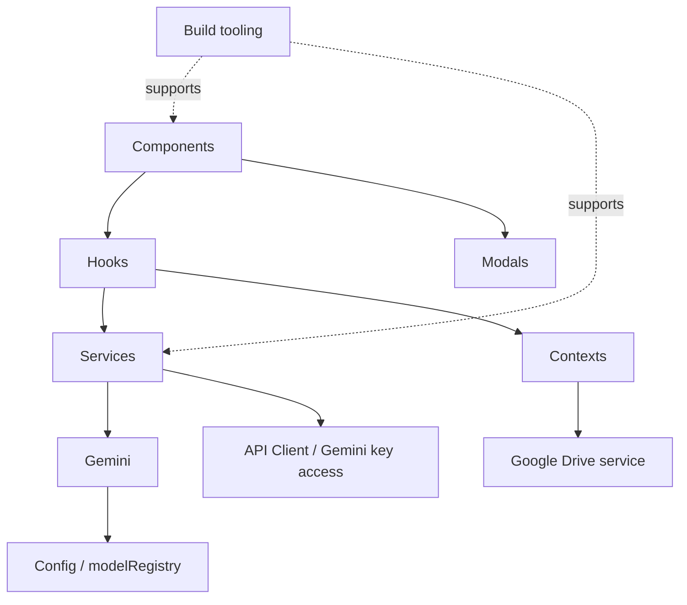

# ARCHITECTURE

> Generated from the GitNexus knowledge graph for `Chang-Store`.
> GitNexus local snapshot at generation time: 155 files, 1209 symbols, 88 execution flows.
> Indexed commit: `22a00e6` (up to date with the local repository when this document was refreshed).

## Overview

Chang-Store is an AI-powered virtual fashion studio built as a React 19 + TypeScript + Vite SPA. The architecture centers on a layered flow from presentation components into hooks, service facades, provider-specific integrations, and global state contexts.

The knowledge graph shows a codebase organized around a few strongly cohesive areas:

- `Components` — presentation layer and feature entry points
- `Hooks` — feature logic and orchestration
- `Services` — stateless service facade layer
- `Gemini` — provider-specific AI image and text operations
- `Config` — model registry and capability selection
- `Contexts` — global app state and cross-feature persistence
- `Modals` — UI overlays and settings surfaces
- `Build` — tooling and runtime setup

At a high level, the application behaves like this:

`Component → Hook → Service/Provider call → Config lookup / API client → Context side effects`

## Functional Areas

### 1. Components

The `Components` cluster is the primary UI surface and contains feature entry points such as `VirtualTryOn`, `PoseChanger`, and other task-specific screens. These components either act as thin wrappers over hooks or, in some older flows, still hold orchestration logic directly.

- Cluster size: 69 symbols
- Cohesion: 92%

### 2. Hooks

The `Hooks` cluster contains feature logic, request orchestration, validation, and state coordination. It is the bridge between UI intent and lower-level services.

- Cluster size: 22 symbols
- Cohesion: 81%

Representative role in graph:
- `useVirtualTryOn` coordinates batch try-on state and image generation.
- `useGoogleDriveSync` mediates gallery actions into Drive requests.

### 3. Services

The `Services` cluster is a highly cohesive facade layer that routes feature actions into provider-specific implementations and shared infrastructure.

- Cluster size: 41 symbols
- Cohesion: 96%

Representative responsibilities:
- image editing/generation orchestration
- Drive access
- API client creation
- text and scene analysis

### 4. Gemini

The `Gemini` cluster contains provider-specific AI generation and transformation logic. GitNexus shows multiple important flows terminating in Gemini image operations before delegating into model capability selection.

- Cluster size: 23 symbols
- Cohesion: 92%

Representative functions seen in the graph:
- `editImage`
- `generateSingleImage`
- `generateImageFromText`
- `upscaleImage`

### 5. Config

The `Config` cluster is a key decision-making layer for model selection and capability routing. The knowledge graph highlights `src/config/modelRegistry.ts` as part of important generation flows.

- Cluster size: 18 symbols
- Cohesion: 85%

Representative functions seen in graph traces:
- `getModelCapabilities`
- `getRegisteredModel`
- `buildModelCandidates`

### 6. Contexts

The `Contexts` cluster manages shared application state and persistence-backed workflows. It appears in key execution flows around image gallery state and Google Drive synchronization.

- Cluster size: 13 symbols
- Cohesion: 90%

Representative role in graph:
- `ImageGalleryProvider` triggers sync work through `useGoogleDriveSync`, which then delegates to Drive service calls.

### 7. Modals

The `Modals` cluster represents highly cohesive UI overlays such as settings and dialogs.

- Cluster size: 13 symbols
- Cohesion: 100%

### 8. Build

The `Build` cluster covers bundling and tooling infrastructure.

- Cluster size: 8 symbols
- Cohesion: 100%

## Mermaid Diagram

```mermaid
flowchart TD
    UI[Components]
    MODALS[Modals]
    HOOKS[Hooks]
    SERVICES[Services]
    GEMINI[Gemini]
    CONFIG[Config / modelRegistry]
    CONTEXTS[Contexts]
    BUILD[Build tooling]
    DRIVE[Google Drive service]
    API[API Client / Gemini key access]

    UI --> HOOKS
    UI --> MODALS
    HOOKS --> SERVICES
    HOOKS --> CONTEXTS
    SERVICES --> GEMINI
    SERVICES --> API
    GEMINI --> CONFIG
    CONTEXTS --> DRIVE
    BUILD -. supports .-> UI
    BUILD -. supports .-> SERVICES
```

## Key Execution Flows

### 1. Edit image → model candidate selection

GitNexus process: `EditImage → BuildModelCandidates` (`intra_community`)

Trace:
1. `editImage` — `src/services/gemini/image.ts`
2. `generateSingleImage` — `src/services/gemini/image.ts`
3. `getModelCapabilities` — `src/config/modelRegistry.ts`
4. `getRegisteredModel` — `src/config/modelRegistry.ts`
5. `buildModelCandidates` — `src/config/modelRegistry.ts`

Why it matters:
- This flow shows that image generation/editing is not just a direct Gemini call.
- The provider layer delegates into a model capability registry before final model candidate construction.
- `src/config/modelRegistry.ts` is a central architecture node for AI routing decisions.

### 2. Gallery persistence → Google Drive

GitNexus process: `ImageGalleryProvider → DriveRequest`

Trace:
1. `ImageGalleryProvider` — `src/contexts/ImageGalleryContext.tsx`
2. `useGoogleDriveSync` — `src/hooks/useGoogleDriveSync.ts`
3. `getOrCreateAppFolder` — `src/services/googleDriveService.ts`
4. `driveRequest` — `src/services/googleDriveService.ts`

Why it matters:
- This flow captures the persistence side of the app, not just AI generation.
- Context-driven gallery state can trigger sync behavior that ultimately becomes Google Drive API traffic.
- It also shows the app’s cross-cutting architecture: context state + hook orchestration + service execution.

### 3. Pose change → service config construction

GitNexus process: `PoseChanger → BuildImageServiceConfig`

Trace:
1. `PoseChanger` — `src/components/PoseChanger.tsx`
2. `handleRegenerateSingle` — `src/components/PoseChanger.tsx`
3. `handleGenerate` — `src/components/PoseChanger.tsx`
4. `generateImageForPrompt` — `src/components/PoseChanger.tsx`
5. `buildImageServiceConfig` — `src/components/PoseChanger.tsx`

Why it matters:
- This is an important exception to the preferred architectural pattern.
- GitNexus shows orchestration staying inside the component instead of cleanly passing through a dedicated hook.
- It identifies `PoseChanger` as a good candidate for future refactoring toward the standard component → hook pattern.

## Known Architectural Exceptions

These items currently deviate from the preferred `Component → Hook → Service` architecture and are ordered below by refactor priority.

1. `PoseChanger` (`src/components/PoseChanger.tsx`) — highest priority because generation orchestration remains a major user-facing flow.
2. `SettingsModal` — high priority because it touches shared provider and model configuration, so layering mistakes here can leak across multiple features.
3. `AIEditor` — high-to-medium priority because it still owns prompt validation and service-dependent generation behavior directly in the component.
4. `PhotoAlbumCreator` — medium priority because it is a feature-specific generation flow with meaningful orchestration.
5. `LookbookOutput`, `shared/RefinementInput` — lower priority because they are downstream output/refinement surfaces and can follow after the higher-leverage orchestration refactors above.

## Refactor Roadmap

The remaining roadmap is to move component-heavy flows toward the target `Component → Hook → Service` architecture without recreating the removed Image Editor, Relight, Upscale, or Outfit Analysis surfaces.

### Verification & Rollback Contract

Required gates for substantive refactors:
1. `npx tsc --noEmit` passes.
2. `npm run lint` passes.
3. `npm run test` passes for the targeted smoke/regression scope.
4. `npm run build` passes at major cross-feature gates.
5. Runtime service imports in scoped components do not increase; phase targets require runtime service imports to reach zero where specified.

Rollback triggers:
- build or test gates fail twice in a row,
- a parity flow breaks,
- provider/model settings behavior regresses,
- or a phase introduces a new architectural exception.

Rollback action: revert the current phase rewiring, restore the previous boundary temporarily, record the blocker and root cause, then reopen the phase with a smaller scope.

| Phase | Required smoke/regression evidence | Rollback |
|---|---|---|
| P0 | Baseline table covering current runtime service/config imports and smoke owners | Docs-only revert |
| P1 | Pose text/reference generate + single regenerate; runtime service/config imports in `PoseChanger` = 0 | Revert P1 commit; component path restored |
| P2 | Provider/model selection persistence, storage backup/restore/clear, debug toggle behavior; provider order snapshot unchanged | Revert P2 commit; restore exported storage backup; reset debug flag |
| P3 | `AIEditor` refine/edit smoke; runtime service imports = 0 | Revert P3 commit |
| P4 | Photo album generate/regenerate smoke; runtime service imports = 0 | Revert P4 commit |
| P5 | Lookbook/refinement compatibility smoke; downstream surfaces remain presentational | Revert P5 commit |

### Current Baseline Inventory

| Target | Existing hook/contract owner | Runtime service/config imports | Scope |
|---|---|---:|---|
| `PoseChanger` (`src/components/PoseChanger.tsx`) | `usePoseChanger` | 0 | Preserve hook-owned generation and upscale side effects. |
| `SettingsModal` (`src/components/modals/SettingsModal.tsx`) | `ApiProviderContext`, `ImageGalleryContext`, storage/debug adapters | 2 | Move model filtering, persistence, backup/restore/clear, and debug toggles behind a focused boundary. |
| `AIEditor` (`src/components/AIEditor.tsx`) | No dedicated hook yet | 1 | Move prompt validation, mention resolution, API call, loading/error, and result state into a hook boundary. |
| `PhotoAlbumCreator` (`src/components/PhotoAlbumCreator.tsx`) | `usePhotoAlbum` exists but is incomplete | 1 | Move pose prompt generation, batch progress, regenerate, loading/error, and gallery side effects into the hook. |
| `LookbookOutput` (`src/components/LookbookOutput.tsx`) | `useLookbookGenerator` owns generation; output component owns downstream UI | 0 | Keep output presentational and reduce service-owned type coupling. |
| `shared/RefinementInput` (`src/components/shared/RefinementInput.tsx`) | Parent lookbook/refinement contract | 0 | Keep refinement input presentational and preserve callback props. |

### Roadmap ADR

Decision: refactor by risk/dependency boundary while prioritizing existing hook completion over new abstractions.

Drivers: reduce blast radius, remove component-level service coupling, and preserve behavior parity.

Follow-ups: after each phase passes its gates, update this section with completed status and any newly discovered exceptions.

## Architectural Conclusions

Based on the GitNexus graph, the most important architectural properties of Chang-Store are:

1. **Layered feature flow** — UI triggers generally move into hooks and services before touching provider APIs.
2. **Config-driven AI routing** — `src/config/modelRegistry.ts` is part of critical generation paths and is now a core architecture dependency.
3. **Strong service cohesion** — the service layer is one of the most cohesive parts of the graph and acts as the routing backbone.
4. **Context-backed persistence** — image gallery and Drive sync are integrated through contexts and orchestration hooks.
5. **Mixed architectural maturity** — some flows follow the intended separation well, while some component-heavy flows still contain orchestration logic inline.

## Recommended Reading Order

If you want to understand the current architecture quickly, start here:

1. GitNexus `context` snapshot
2. `Components`, `Hooks`, `Services`, `Config`, and `Contexts` clusters
3. `EditImage → BuildModelCandidates`
4. `ImageGalleryProvider → DriveRequest`
5. `PoseChanger → BuildImageServiceConfig`
