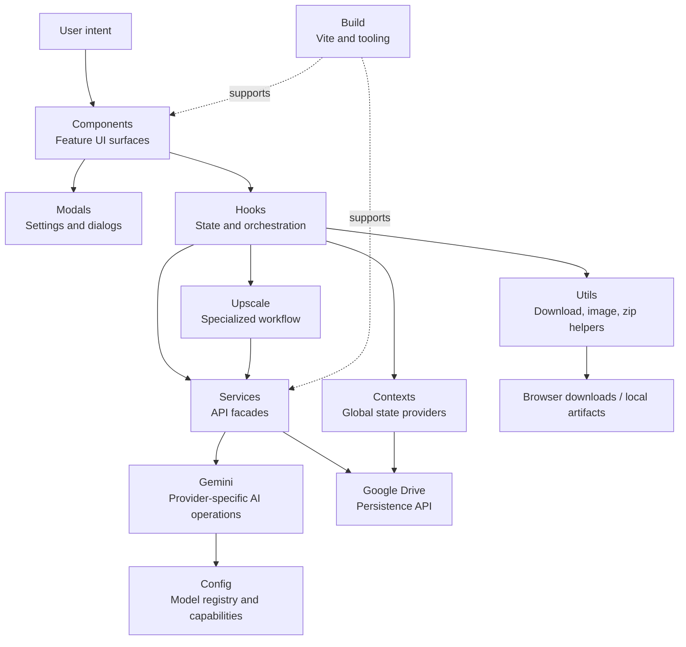

# ARCHITECTURE

> Generated from the GitNexus knowledge graph for `chang-store`.
> Snapshot: 165 files, 2,814 symbols, 87 execution flows.
> Indexed commit: `7eb916e`.

## Overview

Chang-Store is an AI-powered virtual fashion studio built as a React 19 + TypeScript + Vite single-page application. The product architecture is organized around feature surfaces that collect user intent, hooks that own state and orchestration, service facades that isolate external calls, provider-specific Gemini modules, and shared contexts that preserve cross-feature state.

The intended runtime flow is:

```text
Component → Hook → Service Facade → Provider API
```

GitNexus shows that the strongest module boundaries are `Components`, `Services`, `Hooks`, `Gemini`, `Config`, and `Contexts`. Most feature work starts in a component, moves into a feature hook, then reaches shared utilities or service layers for AI calls, downloads, persistence, or model selection.

## Functional Areas

| Area | Symbols | Cohesion | Role |
|---|---:|---:|---|
| Components | 58 | 94% | Feature entry points and UI composition. Components should stay thin and bind state/handlers from hooks. |
| Services | 41 | 96% | Stateless API facades and external-service adapters. Central place for Gemini, Drive, and image-operation routing. |
| Hooks | 34 | 88% | Feature orchestration, state transitions, validation, loading/error handling, and side effects. |
| Gemini | 23 | 92% | Provider-specific AI image/text operations behind service facades. |
| Config | 18 | 85% | Model registry, capability lookup, and model-candidate construction. |
| Contexts | 13 | 90% | Global app state: language, API provider config, gallery, Drive sync, image viewer. |
| Modals | 13 | 100% | Focused overlay surfaces such as settings and dialogs. |
| Build | 8 | 100% | Vite/build/tooling infrastructure. |
| Upscale | 7 | 100% | Specialized image-upscale workflow and analysis path. |

## Architecture Diagram


```mermaid
flowchart TD
    User[User intent]
    Components[Components\nFeature UI surfaces]
    Modals[Modals\nSettings and dialogs]
    Hooks[Hooks\nState and orchestration]
    Contexts[Contexts\nGlobal state providers]
    Services[Services\nAPI facades]
    Gemini[Gemini\nProvider-specific AI operations]
    Config[Config\nModel registry and capabilities]
    Utils[Utils\nDownload, image, zip helpers]
    Drive[Google Drive\nPersistence API]
    Upscale[Upscale\nSpecialized workflow]
    Build[Build\nVite and tooling]

    User --> Components
    Components --> Hooks
    Components --> Modals
    Hooks --> Services
    Hooks --> Contexts
    Hooks --> Utils
    Hooks --> Upscale
    Services --> Gemini
    Services --> Drive
    Gemini --> Config
    Upscale --> Services
    Contexts --> Drive
    Utils --> Downloads[Browser downloads / local artifacts]
    Build -. supports .-> Components
    Build -. supports .-> Services
```

## Key Execution Flows

### 1. Watermark removal download naming → sanitized filename segment

GitNexus process: `WatermarkRemover → SanitizeSegment`

Type: `cross_community`

Trace:

1. `WatermarkRemover` — `src/components/WatermarkRemover.tsx`
2. `useWatermarkRemover` — `src/hooks/useWatermarkRemover.ts`
3. `downloadImageAsJpeg` — `src/utils/imageDownload.ts`
4. `resolveBaseName` — `src/utils/imageDownload.ts`
5. `buildDownloadFilename` — `src/utils/imageDownload.ts`
6. `sanitizeSegment` — `src/utils/imageDownload.ts`

Why it matters:

- This is a clean UI-to-hook-to-utility flow across component, hook, and download helper layers.
- Filename construction is centralized in `src/utils/imageDownload.ts`, so download behavior stays consistent across features.
- Sanitization sits at the system boundary where user-visible filenames leave the app.

### 2. Watermark removal download naming → random filename token

GitNexus process: `WatermarkRemover → CreateRandomToken`

Type: `cross_community`

Trace:

1. `WatermarkRemover` — `src/components/WatermarkRemover.tsx`
2. `useWatermarkRemover` — `src/hooks/useWatermarkRemover.ts`
3. `downloadImageAsJpeg` — `src/utils/imageDownload.ts`
4. `resolveBaseName` — `src/utils/imageDownload.ts`
5. `buildDownloadFilename` — `src/utils/imageDownload.ts`
6. `createRandomToken` — `src/utils/imageDownload.ts`

Why it matters:

- The same feature path also depends on collision-resistant filename token generation.
- `buildDownloadFilename` is a shared choke point for output naming, base-name resolution, sanitization, and uniqueness.
- Changes to image download naming can affect multiple feature surfaces that share this utility path.

### 3. Pose generation → text pose prompt construction

GitNexus process: `PoseChanger → BuildTextPosePrompt`

Type: `intra_community`

Trace:

1. `PoseChanger` — `src/components/PoseChanger.tsx`
2. `handleRegenerateSingle` — `src/hooks/usePoseChanger.ts`
3. `handleGenerate` — `src/hooks/usePoseChanger.ts`
4. `generateImageForPrompt` — `src/hooks/usePoseChanger.ts`
5. `buildTextPosePrompt` — `src/hooks/usePoseChanger.ts`

Why it matters:

- Pose generation orchestration lives in `usePoseChanger`, matching the target component → hook boundary.
- Text prompt construction is close to generation state, which keeps pose-specific business logic out of the component surface.
- Single-regenerate and batch-generate paths converge before prompt construction.

### 4. Pose generation → image service config construction

GitNexus process: `PoseChanger → BuildImageServiceConfig`

Type: `intra_community`

Trace:

1. `PoseChanger` — `src/components/PoseChanger.tsx`
2. `handleRegenerateSingle` — `src/hooks/usePoseChanger.ts`
3. `handleGenerate` — `src/hooks/usePoseChanger.ts`
4. `generateImageForPrompt` — `src/hooks/usePoseChanger.ts`
5. `buildImageServiceConfig` — `src/hooks/usePoseChanger.ts`

Why it matters:

- This flow shows pose feature API configuration is owned by the hook rather than the component.
- Generation and regeneration reuse the same service-config path, reducing divergence between output flows.
- API-provider concerns stay below the UI layer.

### 5. Pattern generation ZIP download → sanitized filename segment

GitNexus process: `PatternGenerator → SanitizeSegment`

Type: `cross_community`

Trace:

1. `PatternGenerator` — `src/components/PatternGenerator.tsx`
2. `usePatternGenerator` — `src/hooks/usePatternGenerator.ts`
3. `downloadImagesAsZip` — `src/utils/zipDownload.ts`
4. `buildDownloadFilename` — `src/utils/imageDownload.ts`
5. `sanitizeSegment` — `src/utils/imageDownload.ts`

Why it matters:

- ZIP export bridges a feature hook, ZIP utility, and shared image-download naming logic.
- `sanitizeSegment` is reused across single-image and multi-image export paths.
- Changes to download filename rules must be validated against both Watermark Remover and Pattern Generator flows.

## Cross-Cutting Architecture Notes

### Shared download boundary

`src/utils/imageDownload.ts` is a high-leverage utility module. GitNexus shows both `WatermarkRemover` and `PatternGenerator` crossing into `buildDownloadFilename`, `sanitizeSegment`, and `createRandomToken` through different export paths.

### Hook-centered feature orchestration

The current pose traces show `PoseChanger` delegates generation handlers and service-config construction into `src/hooks/usePoseChanger.ts`. This matches the documented architecture rule that components should be thin UI wrappers and hooks should own feature logic.

### Service and provider isolation

The service layer remains the integration boundary for external APIs. Gemini-specific behavior belongs under provider modules and model selection belongs in `src/config/modelRegistry.ts`, while UI layers should call through hooks and service facades.

### Context-backed persistence

`Contexts` is a smaller but cohesive area. It owns app-wide state such as provider configuration, gallery data, Drive sync participation, and viewer state. Context changes can have cross-feature impact even when symbol counts are lower than UI or service clusters.

## Recommended Reading Order

1. `src/components/` feature entry points for UI shape.
2. `src/hooks/` paired hooks for orchestration and feature state.
3. `src/services/imageEditingService.ts` and `src/services/gemini/` for AI provider routing.
4. `src/config/modelRegistry.ts` for model capability and selection behavior.
5. `src/contexts/` for provider, gallery, Drive, language, and viewer state; `src/components/Toast.tsx` owns toast state.
6. `src/utils/imageDownload.ts` and `src/utils/zipDownload.ts` for export/download boundaries.
