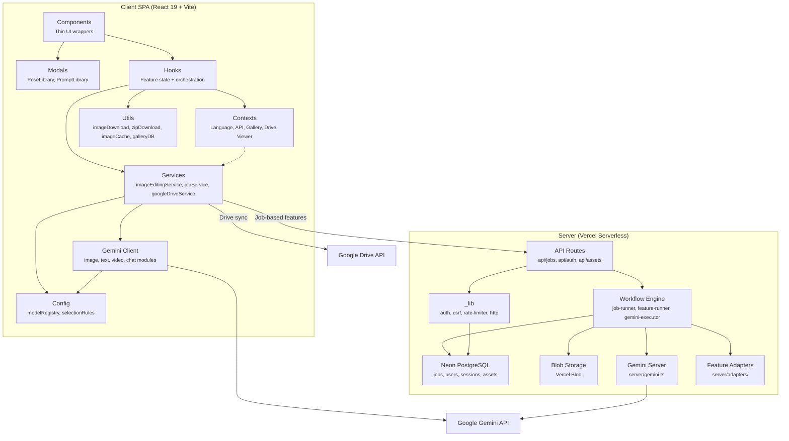
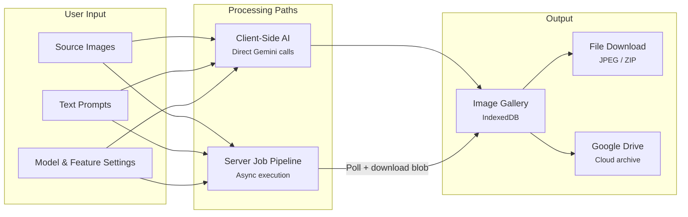

# ARCHITECTURE

> Generated from the GitNexus knowledge graph for `chang-store`.
> Snapshot: **194 files · 3,376 symbols · 222 execution flows**.
> Last regenerated: 2026-05-04.

---

## Overview

Chang-Store is an **AI-powered virtual fashion studio** built as a React 19 + TypeScript + Vite single-page application with a **Gemini-only AI backend** via the Google Gemini SDK. The app supports fashion image creation, editing, gallery review, and Google Drive-backed archive workflows.

### Dual Runtime Architecture

The system operates across two runtimes:

| Runtime | Tech | Responsibility |
|---------|------|----------------|
| **Client (SPA)** | React 19 + Vite | UI, feature hooks, client-side Gemini calls, gallery state |
| **Server (Vercel)** | Serverless Functions + Neon PostgreSQL | Authentication, job pipeline, server-side Gemini execution, blob storage |

The intended request flow is:

```
User → Component (thin UI) → Hook (state + logic) → Service Facade → Gemini API
                                   ↓ (for job-based features)
                              Job Service → API Endpoints → Workflow Engine → Gemini (server)
```

---

## Functional Areas

GitNexus detected **11 functional clusters** via Leiden community detection:

| Area | Symbols | Cohesion | Role |
|------|--------:|----------:|------|
| **_lib** | 64 | 75% | Server-side shared utilities: auth, CSRF, rate limiting, HTTP helpers, tracing |
| **Server** | 61 | 79% | Database (Neon), blob storage, job state machine, Gemini server client, workflow engine |
| **Services** | 50 | 85% | Client-side service facades: imageEditingService, jobService, googleDriveService, textService |
| **Hooks** | 49 | 77% | Feature orchestration hooks: state, validation, batch processing, gallery integration |
| **Gemini** | 22 | 98% | Provider-specific AI modules: image gen/edit, text analysis, video prompts, chat sessions |
| **Config** | 16 | 91% | Model registry, capability lookup, selection rules, model candidate construction |
| **Contexts** | 15 | 87% | Global state providers: Language, API, GoogleDrive, ImageGallery, ImageViewer |
| **Components** | 13 | 87% | Feature entry points: VirtualTryOn, PatternGenerator, GoogleDriveSettings |
| **Modals** | 9 | 100% | UI overlays: PoseLibraryModal, PromptLibraryModal |
| **Build** | 8 | 100% | Vite/ESLint/Vitest tooling infrastructure |
| **Cluster_14** | 6 | 60% | Miscellaneous utilities (lower cohesion, candidates for reorganization) |

### Area Details

#### _lib (Server Utilities)
The backbone of the server-side runtime. Houses authentication middleware, CSRF token generation/validation, rate limiting, HTTP response helpers, and request tracing.

Key symbols: `parseCookies`, `validateCsrfToken`, `createRateLimiter`, `checkRateLimit`, `jsonResponse`, `errorResponse`, `getSessionTokenFromRequest`, `getAuthenticatedUserFromRequest`

#### Server
Database operations (Neon PostgreSQL), blob storage adapters, the job state machine (`canTransition`, `transitionStatus`), server-side Gemini client (`getGeminiClient`, `getApiKey`), and the workflow engine (`executeJob`, `runFeatureJob`, `geminiExecuteStep`).

Key symbols: `createJob`, `getJobById`, `rowToJob`, `jobRecordToRunResult`, `createWorkflowContext`, `updateProgress`, `withErrorHandling`

#### Services (Client Facades)
Stateless service layer routing feature actions into provider-specific implementations. Central routing through `imageEditingService.ts`.

Key symbols: `editImage`, `generateImage`, `upscaleImage`, `recreateImageWithFace`, `pollJob`, `getJob`, `fetchJson`, `getCsrfToken`, `driveRequest`, `uploadImage`

#### Hooks
Feature orchestration layer owning all state, validation, API calls, and gallery integration. One hook per feature.

Key symbols: `useLookbookGenerator`, `usePhotoAlbum`, `useWatermarkRemover`, `usePoseChanger`, `usePatternGenerator`, `useBackgroundReplacer`, `useVirtualTryOn`, `useJobPoll`, `useModelSelection`

#### Gemini (AI Provider)
Provider-specific AI operations behind service facades. Highest cohesion cluster (98%).

Key symbols: `generateImageFromText`, `editImage`, `upscaleImage`, `generateSingleImage`, `createImageChatSession`, `generateText`, `generatePoseDescription`, `generateClothingDescription`, `generateVideo`, `generateVideoSceneSuggestions`

#### Config
Model capability registry and selection rules. Central to all AI generation paths.

Key symbols: `resolveModelSelectionScope`, `getModelsBySelectionType`, `getModelCapabilities`, `getRegisteredModel`, `buildModelCandidates`, `isRegisteredModelId`

#### Contexts
Global state providers following strict nesting order:
```
LanguageProvider → ToastProvider → ApiProvider → GoogleDriveProvider → ImageGalleryProvider → ImageViewerProvider → AppContent
```
> **Note:** `ToastProvider` lives in `src/components/Toast.tsx`, not in `src/contexts/`.

---

## Architecture Diagram


```mermaid
flowchart TD
    subgraph CLIENT["Client SPA (React 19 + Vite)"]
        UI["Components<br/><small>Thin UI wrappers</small>"]
        MODALS["Modals<br/><small>PoseLibrary, PromptLibrary</small>"]
        HOOKS["Hooks<br/><small>Feature state + orchestration</small>"]
        CONTEXTS["Contexts<br/><small>Language, API, Gallery, Drive, Viewer</small>"]
        SERVICES["Services<br/><small>imageEditingService, jobService, googleDriveService</small>"]
        GEMINI_CLIENT["Gemini Client<br/><small>image, text, video, chat modules</small>"]
        CONFIG["Config<br/><small>modelRegistry, selectionRules</small>"]
        UTILS["Utils<br/><small>imageDownload, zipDownload, imageCache, galleryDB</small>"]
    end

    subgraph SERVER["Server (Vercel Serverless)"]
        API["API Routes<br/><small>api/jobs, api/auth, api/assets</small>"]
        LIB["_lib<br/><small>auth, csrf, rate-limiter, http</small>"]
        WORKFLOWS["Workflow Engine<br/><small>job-runner, feature-runner, gemini-executor</small>"]
        DB["Neon PostgreSQL<br/><small>jobs, users, sessions, assets</small>"]
        BLOB["Blob Storage<br/><small>Vercel Blob</small>"]
        GEMINI_SERVER["Gemini Server<br/><small>server/gemini.ts</small>"]
        ADAPTERS["Feature Adapters<br/><small>server/adapters/</small>"]
    end

    GDRIVE["Google Drive API"]
    GEMINI_API["Google Gemini API"]

    UI --> HOOKS
    UI --> MODALS
    HOOKS --> SERVICES
    HOOKS --> CONTEXTS
    HOOKS --> UTILS
    SERVICES --> GEMINI_CLIENT
    SERVICES --> CONFIG
    GEMINI_CLIENT --> CONFIG
    GEMINI_CLIENT --> GEMINI_API
    CONTEXTS -.-> SERVICES

    SERVICES -->|"Job-based features"| API
    API --> LIB
    API --> WORKFLOWS
    WORKFLOWS --> ADAPTERS
    WORKFLOWS --> GEMINI_SERVER
    WORKFLOWS --> DB
    WORKFLOWS --> BLOB
    GEMINI_SERVER --> GEMINI_API
    LIB --> DB

    SERVICES -->|"Drive sync"| GDRIVE
```

---

## Key Execution Flows

### 1. Server-Side Job Pipeline

The core async pipeline for feature execution through the server.

**Process:** `ExecuteJob → RowToJob` (cross_community, 5 steps)

```
executeJob (server/workflows/job-runner.ts)
  → runFeatureJob (workflows/feature-runner.ts)
    → FeatureAdapter.run() (server/adapters/)
      → geminiExecuteStep (server/workflows/gemini-executor.ts)
        → generateImage / editImage (server/gemini.ts)
          → Google Gemini API
```

**Why it matters:**
- This is the primary server-side execution path for all job-based features
- Uses the `FeatureAdapter` interface pattern for per-feature dispatch
- Job state transitions are tracked in Neon PostgreSQL via `transitionStatus`
- Results are stored as blobs and associated with job assets
- Error handling via `withErrorHandling` wrapper and `updateProgress` for progress tracking

### 2. Client Job Polling

How the client-side hooks wait for server-side job completion.

**Process:** `UseLookbookGenerator → GetCsrfToken` (cross_community, 5 steps)

```
useLookbookGenerator (src/hooks/useLookbookGenerator.ts)
  → pollJob (src/services/jobService.ts)
    → getJob (src/services/jobService.ts)
      → fetchJson (src/services/jobService.ts)
        → getCsrfToken (src/services/jobService.ts)
```

**Also observed in:** `UsePhotoAlbum → GetCsrfToken`, `UseJobPoll → GetCsrfToken`

**Why it matters:**
- All job-based feature hooks share this polling pattern
- CSRF token is extracted from cookies for authenticated API calls
- `fetchJson` handles response parsing and error mapping to `JobHttpError`
- Same pattern is reused across Lookbook, PhotoAlbum, and the generic `useJobPoll` hook

### 3. Authentication & Session Flow

Server-side request authentication pipeline.

**Process:** `Fetch → ParseCookies` (cross_community, 5 steps)

```
fetch (api/jobs/index.ts)
  → getAuthenticatedSessionFromRequest (api/_lib/auth.ts)
    → getAuthenticatedUserFromRequest (api/_lib/auth.ts)
      → getSessionTokenFromRequest (api/_lib/auth.ts)
        → parseCookies (api/_lib/auth.ts)
```

**Also observed in:** `Fetch → ToAuthenticatedUser`, `Fetch → GetDefaultSeededUsers`

**Why it matters:**
- Every API route goes through this authentication chain
- Cookie-based session management with seeded user support
- Session tokens are extracted and validated before any job operation
- Connects to `DecodeBase64Url` for JWT-style token parsing

### 4. CSRF Protection

Double-submit cookie pattern for state-changing requests.

**Process:** `WithCsrf → GenerateCsrfToken` (intra_community, 3 steps)

```
withCsrf (api/_lib/csrf-middleware.ts)
  → addCsrfCookie (api/_lib/csrf-middleware.ts)
    → generateCsrfToken (api/_lib/csrf.ts)
```

**Also:** `WithCsrf → ParseCookies` for validation path

**Why it matters:**
- Middleware pattern wrapping all mutating API routes
- Token generation, cookie setting, and validation are cleanly separated
- Both server-side validation and client-side token extraction share the same cookie name constants

### 5. Watermark Removal → Download

End-to-end feature flow from UI to sanitized file download.

**Process:** `WatermarkRemover → SanitizeSegment` (cross_community, 6 steps)

```
WatermarkRemover (src/components/WatermarkRemover.tsx)
  → useWatermarkRemover (src/hooks/useWatermarkRemover.ts)
    → downloadImageAsJpeg (src/utils/imageDownload.ts)
      → resolveBaseName (src/utils/imageDownload.ts)
        → buildDownloadFilename (src/utils/imageDownload.ts)
          → sanitizeSegment (src/utils/imageDownload.ts)
```

**Why it matters:**
- Demonstrates the full `Component → Hook → Utility` layered flow
- Longest traced process (6 steps) — spans 3 functional areas
- File naming and sanitization are handled in the utility layer, not the hook

### 6. Server-Side Gemini Execution

AI image generation/editing on the server via workflow engine.

**Process:** `GeminiExecuteStep → GetApiKey` (intra_community, 5 steps)

```
geminiExecuteStep (server/workflows/gemini-executor.ts)
  → editImage / generateImage (server/gemini.ts)
    → getGeminiClient (server/gemini.ts)
      → getApiKey (server/gemini.ts)
```

**Why it matters:**
- Server-side Gemini calls use a separate client from client-side (`server/gemini.ts` vs `src/services/apiClient.ts`)
- `FEATURE_PROMPTS` map in `gemini-executor.ts` provides per-feature prompt dispatch
- API key management is server-controlled, not exposed to the client for job-based features

---

## Data Flow Diagram


```mermaid
flowchart LR
    subgraph INPUT["User Input"]
        IMG["Source Images"]
        PROMPT["Text Prompts"]
        SETTINGS["Model & Feature Settings"]
    end

    subgraph PROCESSING["Processing Paths"]
        direction TB
        CLIENT_AI["Client-Side AI<br/><small>Direct Gemini calls</small>"]
        SERVER_JOB["Server Job Pipeline<br/><small>Async execution</small>"]
    end

    subgraph OUTPUT["Output"]
        GALLERY["Image Gallery<br/><small>IndexedDB</small>"]
        DOWNLOAD["File Download<br/><small>JPEG / ZIP</small>"]
        DRIVE["Google Drive<br/><small>Cloud archive</small>"]
    end

    IMG --> CLIENT_AI
    IMG --> SERVER_JOB
    PROMPT --> CLIENT_AI
    PROMPT --> SERVER_JOB
    SETTINGS --> CLIENT_AI
    SETTINGS --> SERVER_JOB

    CLIENT_AI --> GALLERY
    SERVER_JOB -->|"Poll + download blob"| GALLERY
    GALLERY --> DOWNLOAD
    GALLERY --> DRIVE
```

---

## Feature Routing

Each feature maps to a `Feature` enum value in `src/types.ts` and is lazy-loaded in `src/App.tsx`:

| Feature | Component | Hook | Execution Path |
|---------|-----------|------|----------------|
| TryOn | `VirtualTryOn` | `useVirtualTryOn` | Server job pipeline |
| Lookbook | `LookbookGenerator` | `useLookbookGenerator` | Server job pipeline |
| Background | `BackgroundReplacer` | `useBackgroundReplacer` | Server job pipeline |
| Pose | `PoseChanger` | `usePoseChanger` | Server job pipeline |
| PhotoAlbum | `PhotoAlbumCreator` | `usePhotoAlbum` | Server job pipeline |
| AIEditor | `AIEditor` | `useAIEditor` | Client-side Gemini |
| WatermarkRemover | `WatermarkRemover` | `useWatermarkRemover` | Client-side Gemini |
| ClothingTransfer | — | — | Planned |
| PatternGenerator | `PatternGenerator` | `usePatternGenerator` | Client-side Gemini |

---

## Directory Structure

```
chang-store/
├── api/                    # Vercel serverless API routes
│   ├── _lib/               # Shared server utilities (auth, csrf, rate-limiter, http)
│   ├── auth/               # Login, session endpoints
│   ├── assets/             # Blob asset serving
│   └── jobs/               # Job CRUD + status endpoints
├── server/                 # Server-side business logic
│   ├── adapters/           # Feature-specific job adapters
│   ├── workflows/          # Job runner, Gemini executor
│   ├── db.ts               # Neon PostgreSQL queries
│   ├── blob.ts             # Vercel Blob storage
│   ├── gemini.ts           # Server-side Gemini client
│   └── jobs.ts             # Job state machine
├── workflows/              # High-level workflow orchestration
│   ├── feature-runner.ts   # Feature adapter dispatch + cleanup
│   ├── helpers.ts          # Workflow context, error handling, progress
│   └── canary.ts           # Deployment health checks
├── src/                    # Client SPA source
│   ├── components/         # Feature UI + shared components + modals
│   ├── hooks/              # Feature hooks (1:1 with components)
│   ├── services/           # Client service facades
│   │   ├── gemini/         # Provider-specific modules (image, text, video, chat)
│   │   ├── imageEditingService.ts  # Central AI routing facade
│   │   ├── jobService.ts   # Job polling + CSRF
│   │   └── googleDriveService.ts   # Drive sync
│   ├── contexts/           # Global state providers
│   ├── config/             # Model registry + selection rules
│   ├── utils/              # Pure helpers (download, cache, zip, gallery)
│   ├── locales/            # i18n (en.ts source, vi.ts mirror)
│   ├── App.tsx             # Feature router (enum switch)
│   └── types.ts            # Shared type definitions + Feature enum
├── __tests__/              # Vitest + RTL test suites (mirrors src/)
├── docs/                   # Architecture + API references
└── types/                  # Ambient TypeScript declarations
```

---

## Architectural Conclusions

Based on the GitNexus knowledge graph (3,376 symbols, 222 execution flows):

1. **Dual-runtime architecture** — Client SPA handles direct AI interactions and UI state; server handles authenticated job pipelines with async execution.

2. **Adapter-based job dispatch** — Server-side features use `FeatureAdapter` interface for clean per-feature dispatch through a shared workflow engine.

3. **Layered feature flow** — UI triggers move through `Component → Hook → Service → Gemini/API`, with hooks owning all state and orchestration.

4. **Config-driven AI routing** — `modelRegistry.ts` is central to all generation paths. Model selection flows through `resolveModelSelectionScope()` → `getModelsBySelectionType()`.

5. **Strong service cohesion** — The Services cluster (85%) and Gemini cluster (98%) show well-defined boundaries with minimal leakage.

6. **Context-backed persistence** — Gallery state → Drive sync is mediated through contexts and orchestration hooks, keeping the persistence layer separate from feature logic.

7. **CSRF double-submit pattern** — All mutating API routes are protected by `withCsrf` middleware with matching client-side token extraction.

8. **Shared polling pattern** — Job-based features share `pollJob → getJob → fetchJson → getCsrfToken` across all hooks (Lookbook, PhotoAlbum, TryOn, Pose, Background).

---

## Recommended Reading Order

1. `src/types.ts` — Feature enum and shared type definitions
2. `src/App.tsx` — Feature routing and provider nesting
3. `src/components/` — Feature entry points for UI shape
4. `src/hooks/` — Paired hooks for orchestration and feature state
5. `src/services/imageEditingService.ts` — Central AI routing facade
6. `src/services/gemini/` — Provider-specific AI operations
7. `src/config/modelRegistry.ts` — Model capability and selection
8. `src/contexts/` — Global state providers
9. `api/` + `server/` — Server-side job pipeline and authentication
10. `workflows/` — Feature runner and Gemini executor
11. `src/utils/` — Download, cache, zip, and gallery utilities
