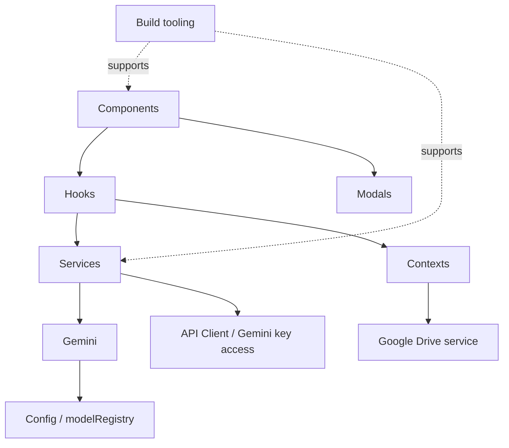

# ARCHITECTURE

> Generated from the GitNexus knowledge graph for `chang-store`.
> Snapshot: 165 files, 2,814 symbols, 87 execution flows.
> Indexed commit: `7eb916e`.

## Overview

Chang-Store is an AI-powered virtual fashion studio built as a React 19 + TypeScript + Vite single-page application. The product architecture is organized around feature surfaces that collect user intent, hooks that own state and orchestration, service facades that isolate external calls, provider-specific Gemini modules, and shared contexts that preserve cross-feature state.

The intended runtime flow is:

- `Components` — presentation layer and feature entry points
- `Hooks` — feature logic and orchestration
- `Services` — stateless service facade layer
- `Gemini` — provider-specific AI image and text operations
- `Config` — model registry and capability selection
- `Contexts` — global app state and cross-feature persistence
- `Modals` — UI overlays and settings surfaces
- `Build` — tooling and runtime setup

GitNexus shows that the strongest module boundaries are `Components`, `Services`, `Hooks`, `Gemini`, `Config`, and `Contexts`. Most feature work starts in a component, moves into a feature hook, then reaches shared utilities or service layers for AI calls, downloads, persistence, or model selection.

## Functional Areas

| Area | Symbols | Cohesion | Role |
|---|---:|---:|---|
| Components | 58 | 94% | Feature entry points and UI composition. Components should stay thin and bind state/handlers from hooks. |
| Services | 41 | 96% | Stateless API facades and external-service adapters. Central place for Gemini, Drive, and image-operation routing. |
| Hooks | 34 | 88% | Feature orchestration, state transitions, validation, loading/error handling, and side effects. |
| Gemini | 23 | 92% | Provider-specific AI image/text operations behind service facades. |
| Config | 18 | 85% | Model registry, capability lookup, and model-candidate construction. |
| Contexts | 13 | 90% | Global app state: language, API provider config, gallery, Drive sync, image viewer. |
| Modals | 13 | 100% | Focused overlay surfaces such as settings and dialogs. |
| Build | 8 | 100% | Vite/build/tooling infrastructure. |

The `Components` cluster is the primary UI surface and contains feature entry points such as `VirtualTryOn`, `PoseChanger`, and other task-specific screens. These components either act as thin wrappers over hooks or, in some older flows, still hold orchestration logic directly.

- Cluster size: 69 symbols
- Cohesion: 92%

### 2. Hooks

The `Hooks` cluster contains feature logic, request orchestration, validation, and state coordination. It is the bridge between UI intent and lower-level services.

- Cluster size: 22 symbols
- Cohesion: 81%

Representative role in graph:
- `useVirtualTryOn` coordinates batch try-on state and image generation.
- `useGoogleDriveSync` mediates gallery actions into Drive requests.

### 3. Services

The `Services` cluster is a highly cohesive facade layer that routes feature actions into provider-specific implementations and shared infrastructure.

- Cluster size: 41 symbols
- Cohesion: 96%

Representative responsibilities:
- image editing/generation orchestration
- Drive access
- API client creation
- text and scene analysis

### 4. Gemini

The `Gemini` cluster contains provider-specific AI generation and transformation logic. GitNexus shows multiple important flows terminating in Gemini image operations before delegating into model capability selection.

- Cluster size: 23 symbols
- Cohesion: 92%

Representative functions seen in the graph:
- `editImage`
- `generateSingleImage`
- `generateImageFromText`
- `upscaleImage`

### 5. Config

The `Config` cluster is a key decision-making layer for model selection and capability routing. The knowledge graph highlights `src/config/modelRegistry.ts` as part of important generation flows.

- Cluster size: 18 symbols
- Cohesion: 85%

Representative functions seen in graph traces:
- `getModelCapabilities`
- `getRegisteredModel`
- `buildModelCandidates`

### 6. Contexts

The `Contexts` cluster manages shared application state and persistence-backed workflows. It appears in key execution flows around image gallery state and Google Drive synchronization.

- Cluster size: 13 symbols
- Cohesion: 90%

Representative role in graph:
- `ImageGalleryProvider` triggers sync work through `useGoogleDriveSync`, which then delegates to Drive service calls.

### 7. Modals

The `Modals` cluster represents highly cohesive UI overlays such as settings and dialogs.

- Cluster size: 13 symbols
- Cohesion: 100%

### 8. Build

The `Build` cluster covers bundling and tooling infrastructure.

- Cluster size: 8 symbols
- Cohesion: 100%

## Mermaid Diagram

```mermaid
flowchart TD
    UI[Components]
    MODALS[Modals]
    HOOKS[Hooks]
    SERVICES[Services]
    GEMINI[Gemini]
    CONFIG[Config / modelRegistry]
    CONTEXTS[Contexts]
    BUILD[Build tooling]
    DRIVE[Google Drive service]
    API[API Client / Gemini key access]

    UI --> HOOKS
    UI --> MODALS
    HOOKS --> SERVICES
    HOOKS --> CONTEXTS
    SERVICES --> GEMINI
    SERVICES --> API
    GEMINI --> CONFIG
    CONTEXTS --> DRIVE
    BUILD -. supports .-> UI
    BUILD -. supports .-> SERVICES
```

## Key Execution Flows

### 1. Watermark removal single-image download naming → sanitized filename segment

GitNexus process: `WatermarkRemover → SanitizeSegment`

Type: `cross_community`

Trace:

1. `WatermarkRemover` — `src/components/WatermarkRemover.tsx`
2. `useWatermarkRemover` — `src/hooks/useWatermarkRemover.ts`
3. `downloadImageAsJpeg` — `src/utils/imageDownload.ts`
4. `resolveBaseName` — `src/utils/imageDownload.ts`
5. `sanitizeSegment` — `src/utils/imageDownload.ts`

Why it matters:

### 2. Gallery persistence → Google Drive

GitNexus process: `ImageGalleryProvider → DriveRequest`

Trace:
1. `ImageGalleryProvider` — `src/contexts/ImageGalleryContext.tsx`
2. `useGoogleDriveSync` — `src/hooks/useGoogleDriveSync.ts`
3. `getOrCreateAppFolder` — `src/services/googleDriveService.ts`
4. `driveRequest` — `src/services/googleDriveService.ts`

Why it matters:
- This flow captures the persistence side of the app, not just AI generation.
- Context-driven gallery state can trigger sync behavior that ultimately becomes Google Drive API traffic.
- It also shows the app’s cross-cutting architecture: context state + hook orchestration + service execution.

### 3. Pose change → service config construction

GitNexus process: `PoseChanger → BuildImageServiceConfig`

Type: `intra_community`

Trace:

1. `PoseChanger` — `src/components/PoseChanger.tsx`
2. `handleRegenerateSingle` — `src/hooks/usePoseChanger.ts`
3. `handleGenerate` — `src/hooks/usePoseChanger.ts`
4. `generateImageForPrompt` — `src/hooks/usePoseChanger.ts`
5. `buildImageServiceConfig` — `src/hooks/usePoseChanger.ts`

Why it matters:

- This flow shows pose feature API configuration is owned by the hook rather than the component.
- Generation and regeneration reuse the same service-config path, reducing divergence between output flows.
- API-provider concerns stay below the UI layer.

### 5. Pattern generation ZIP download → sanitized filename segment

1. `PatternGenerator` (`src/components/PatternGenerator.tsx`) — user clicks "Download All as ZIP"
2. `handleDownloadAllZip` — `src/hooks/usePatternGenerator.ts`
3. `downloadImagesAsZip` — `src/utils/zipDownload.ts`
4. `getZipEntryPrefix` — `src/utils/zipDownload.ts` (strips `.zip` and `-batch` suffix)
5. `buildDownloadFilename` — `src/utils/imageDownload.ts` (produces `pattern-generator-001.jpg`, etc.)

Why it matters:

- This flow shows the ZIP download path stays entirely in the hook, matching the `Component → Hook → Service` architecture.
- The filename sanitization (`getZipEntryPrefix`) ensures clean entry names inside the archive regardless of the caller-supplied archive name.
- Image-to-JPEG conversion happens inside the utility layer, not the hook, keeping the hook focused on orchestration.

Required gates for substantive refactors:
1. `npx tsc --noEmit` passes.
2. `npm run lint` passes.
3. `npm run test` passes for the targeted smoke/regression scope.
4. `npm run build` passes at major cross-feature gates.
5. Runtime service imports in scoped components do not increase; phase targets require runtime service imports to reach zero where specified.

### Context-backed persistence

Rollback action: revert the current phase rewiring, restore the previous boundary temporarily, record the blocker and root cause, then reopen the phase with a smaller scope.

| Phase | Required smoke/regression evidence | Rollback |
|---|---|---|
| P0 | Baseline table covering current runtime service/config imports and smoke owners | Docs-only revert |
| P1 | Pose text/reference generate + single regenerate; runtime service/config imports in `PoseChanger` = 0 | Revert P1 commit; component path restored |
| P2 | Provider/model selection persistence, storage backup/restore/clear, debug toggle behavior; provider order snapshot unchanged | Revert P2 commit; restore exported storage backup; reset debug flag |
| P3 | `AIEditor` refine/edit smoke; runtime service imports = 0 | Revert P3 commit |
| P4 | Photo album generate/regenerate smoke; runtime service imports = 0 | Revert P4 commit |
| P5 | Lookbook/refinement compatibility smoke; downstream surfaces remain presentational | Revert P5 commit |

### Current Baseline Inventory

| Target | Existing hook/contract owner | Runtime service/config imports | Scope |
|---|---|---:|---|
| `PoseChanger` (`src/components/PoseChanger.tsx`) | `usePoseChanger` | 0 | Preserve hook-owned generation and upscale side effects. |
| `SettingsModal` (`src/components/modals/SettingsModal.tsx`) | `useSettingsModal` | 0 | Keep the modal presentational while the hook owns model filtering, persistence, backup/restore/clear, and debug toggles. |
| `AIEditor` (`src/components/AIEditor.tsx`) | `useAIEditor` | 0 | Keep prompt validation, mention resolution, API calls, loading/error, and result state inside the hook boundary. |
| `PhotoAlbumCreator` (`src/components/PhotoAlbumCreator.tsx`) | `usePhotoAlbum` | 0 | Keep pose prompt generation, batch progress, regenerate, loading/error, and related orchestration inside the hook boundary. |
| `LookbookOutput` (`src/components/LookbookOutput.tsx`) | `useLookbookGenerator` owns generation; output component owns downstream UI | 0 | Keep output presentational and reduce service-owned type coupling. |
| `shared/RefinementInput` (`src/components/shared/RefinementInput.tsx`) | Parent lookbook/refinement contract | 0 | Keep refinement input presentational and preserve callback props. |

### Roadmap ADR

Decision: refactor by risk/dependency boundary while prioritizing existing hook completion over new abstractions.

Drivers: reduce blast radius, remove component-level service coupling, and preserve behavior parity.

Follow-ups: after each phase passes its gates, update this section with completed status and any newly discovered exceptions.

## Architectural Conclusions

Based on the GitNexus graph, the most important architectural properties of Chang-Store are:

1. **Layered feature flow** — UI triggers generally move into hooks and services before touching provider APIs.
2. **Config-driven AI routing** — `src/config/modelRegistry.ts` is part of critical generation paths and is now a core architecture dependency.
3. **Strong service cohesion** — the service layer is one of the most cohesive parts of the graph and acts as the routing backbone.
4. **Context-backed persistence** — image gallery and Drive sync are integrated through contexts and orchestration hooks.
5. **Mixed architectural maturity** — some flows follow the intended separation well, while some component-heavy flows still contain orchestration logic inline.

## Recommended Reading Order

1. `src/components/` feature entry points for UI shape.
2. `src/hooks/` paired hooks for orchestration and feature state.
3. `src/services/imageEditingService.ts` and `src/services/gemini/` for AI provider routing.
4. `src/config/modelRegistry.ts` for model capability and selection behavior.
5. `src/contexts/` for provider, gallery, Drive, language, and viewer state; `src/components/Toast.tsx` owns toast state.
6. `src/utils/imageDownload.ts` and `src/utils/zipDownload.ts` for export/download boundaries.
