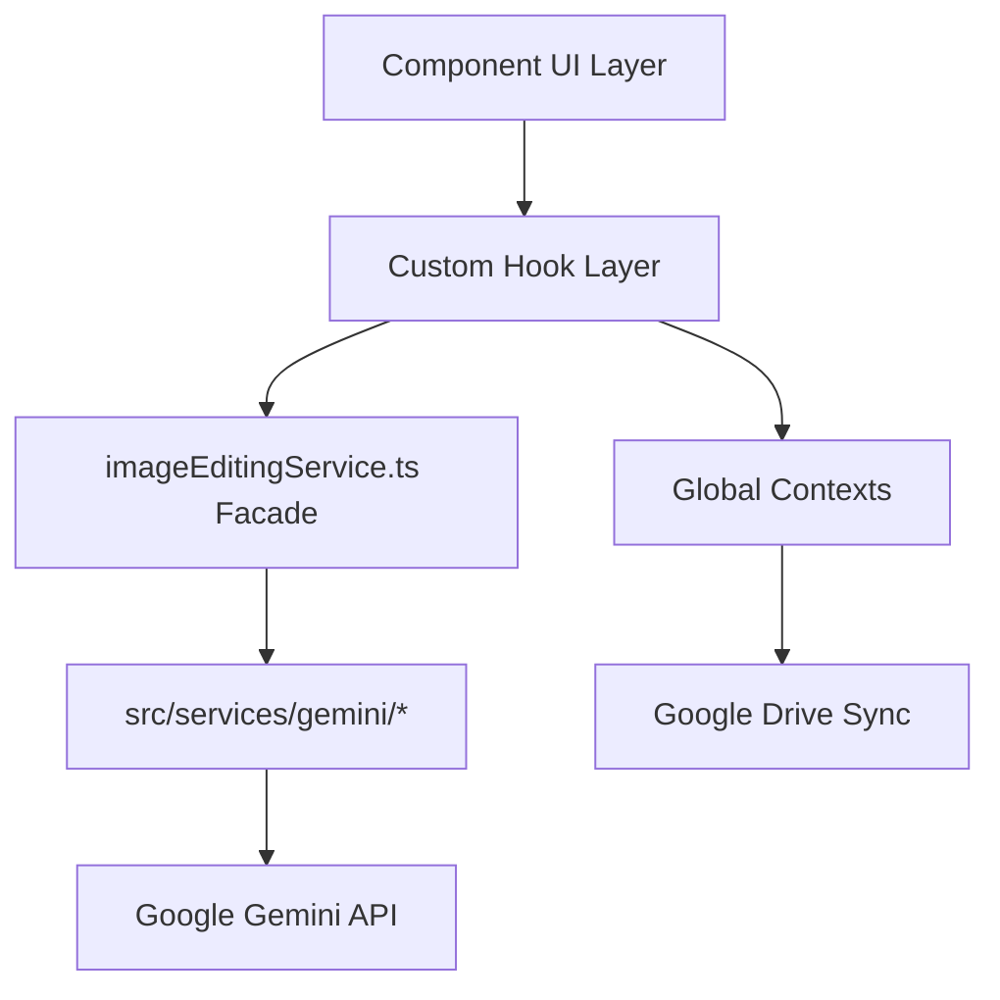

# System Architecture

## Architecture Overview
Chang-Store follows a strict unidirectional service architecture focused on separating UI from business logic and AI integration.

## Component Roles
1. **Component (Thin UI)**: Renders Tailwind-styled HTML and handles user interactions. Does not manage complex state or API calls.
2. **Hook (State + Logic)**: Centralizes all logic, error handling, loading states, and side effects. Connects the Component to the Service layer.
3. **Service Facade (`imageEditingService.ts`)**: Central router for all image-related API requests. Selects the correct model configuration using the model registry.
4. **Gemini Service**: Handles low-level payload construction and direct interaction with the `@google/genai` SDK.

## Global State Providers
The application is wrapped in a strict provider hierarchy to ensure dependencies are properly initialized:
1. `LanguageProvider`
2. `ToastProvider`
3. `ApiProvider` (manages keys)
4. `GoogleDriveProvider` (depends on ApiProvider)
5. `ImageGalleryProvider`
6. `ImageViewerProvider`
7. `AppContent` (The main switch router based on `Feature` enum)

## Feature Routing
Routing is handled manually without a router library. The `Feature` enum defines available screens: `TryOn`, `Lookbook`, `Background`, `Pose`, `PhotoAlbum`, `AIEditor`, `WatermarkRemover`, `ClothingTransfer`, `PatternGenerator`.
