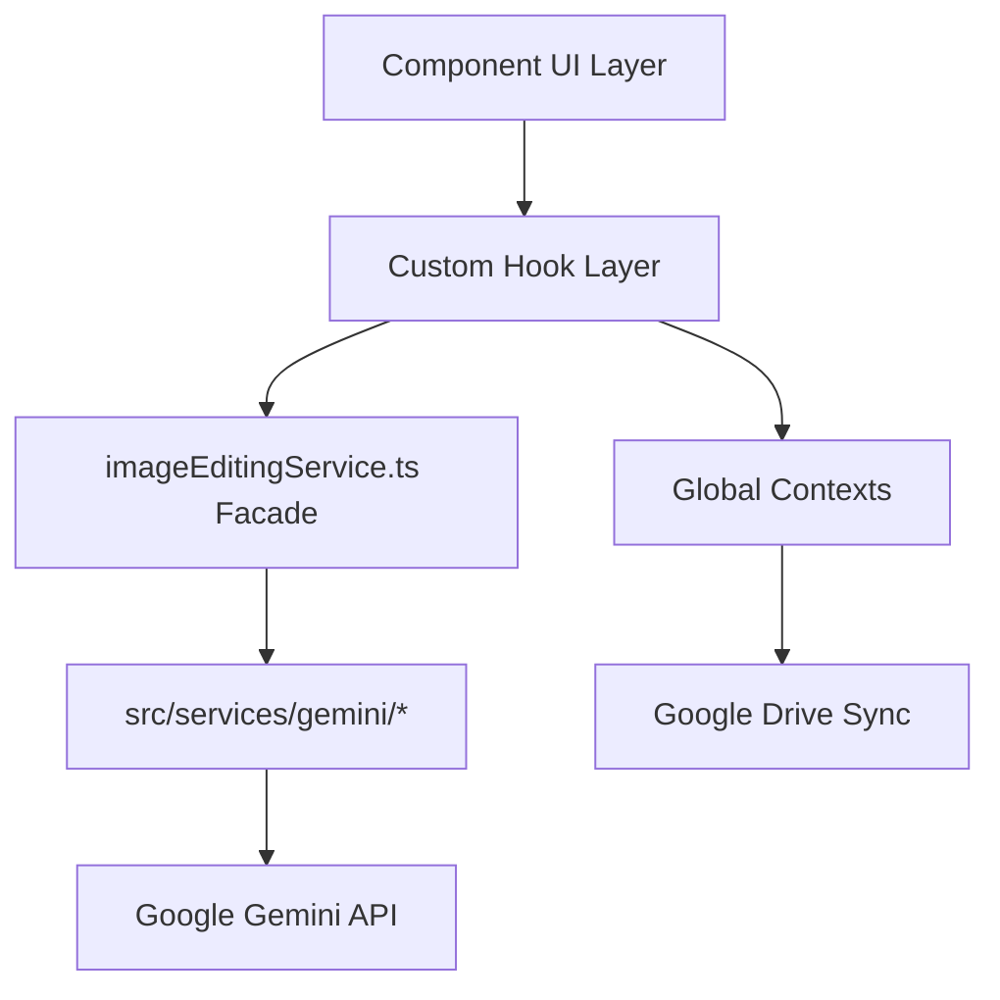

# System Architecture

## Architecture Overview
Chang-Store follows a strict unidirectional service architecture focused on separating UI from business logic and AI integration.



## Component Roles
1. **Component (Thin UI)**: Renders Tailwind-styled HTML and handles user interactions. Does not manage complex state or API calls.
2. **Hook (State + Logic)**: Centralizes all logic, error handling, loading states, and side effects. Connects the Component to the Service layer.
3. **Service Facade (`imageEditingService.ts`)**: Central router for all image-related API requests. Selects the correct model configuration using the model registry.
4. **Gemini Service**: Handles low-level payload construction and direct interaction with the `@google/genai` SDK.

## Global State Providers
The application is wrapped in a strict provider hierarchy to ensure dependencies are properly initialized:
1. `LanguageProvider`
2. `ToastProvider`
3. `ApiProvider` (manages keys)
4. `GoogleDriveProvider` (depends on ApiProvider)
5. `ImageGalleryProvider`
6. `ImageViewerProvider`
7. `AppContent` (The main switch router based on `Feature` enum)

## Feature Routing
Routing is handled manually without a router library. The `Feature` enum defines available screens: `TryOn`, `Lookbook`, `Background`, `Pose`, `PhotoAlbum`, `AIEditor`, `WatermarkRemover`, `ClothingTransfer`, `PatternGenerator`.

## Model Registry
The `src/config/modelRegistry.ts` (218 LOC) maintains a capability registry mapping features to Gemini models. This centralized registry enables:
- Feature-to-model routing
- Model capability validation
- Fallback model selection
- Version management

## Error Handling Pattern
All hooks follow a mandatory error handling pattern:
```typescript
try {
  // API call or operation
} catch (err) {
  setError(getErrorMessage(err, t));
} finally {
  setIsLoading(false);
}
```

Error messages are localized via the `useLanguage()` hook and displayed through the `ToastProvider`.

## Data Persistence Layer
- **IndexedDB**: Gallery images persisted via `idb-keyval` wrapper (`src/utils/galleryDB.ts`)
- **Google Drive**: Cloud archiving and sync via `src/services/googleDriveService.ts` (411 LOC)
- **Local Storage**: Settings and user preferences

## Prompt Builder Pattern
Feature-specific prompt builders in `src/utils/` construct AI prompts with domain-specific logic:
- `clothing-transfer-prompt-builder.ts` — Enforces source-destination separation and spatial realism
- `virtual-try-on-prompt-builder.ts` — Handles source type selection and garment notes
- `lookbookPromptBuilder.ts` — Lookbook composition and styling
- `pattern-generator-prompt-builder.ts` — Pattern generation parameters
- `watermark-prompts.ts` — Watermark removal strategies

## Batch Processing
- `src/utils/batch-image-session.ts` — Multi-image session management
- `src/utils/run-bounded-workers.ts` — Bounded worker pool for parallel processing
- Watermark removal and clothing transfer support batch operations
